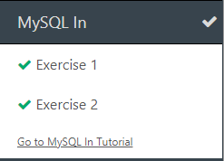
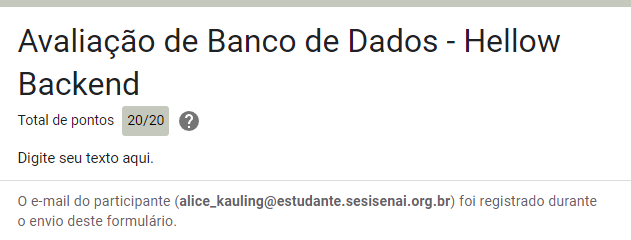

# Diário de Bordo - [Hellow 2024/Trilha DEV Backend]

## Data: [DD-MM-AAA]

### O que aprendi hoje:
Descreva em detalhes o que você aprendeu durante a aula de hoje. Tente ser o mais específico possível, mencionando conceitos, técnicas ou insights que foram importantes para você.

### O que achei mais difícil:
Explique quais partes da aula de hoje foram mais desafiadoras para você e por quê. Isso pode incluir tópicos que você achou complexos, perguntas que permaneceram sem resposta ou habilidades que você sentiu que precisava desenvolver mais.

### O que mais gostei:
Compartilhe o que você mais gostou na aula de hoje. Isso pode ser um tópico específico que foi discutido, uma atividade prática que foi realizada, ou mesmo uma história ou exemplo que o professor compartilhou.

### Sentimento do dia:

Escolha um GIF que melhor represente seu sentimento sobre a aula de hoje. Você pode usar sites como Giphy para encontrar o GIF perfeito.
---
# Data: [11 e 18-04-2024]

### O que aprendi hoje:
aprendemos alguns códigos;git push,clear,git log são alguns códigos. 

### O que achei mais difícil:
Lembrar e memorizar os codigos e alguns comandos.

### O que mais gostei:
Fazer nosso curriculo
### Sentimento do dia:

.
## Data: [25-04-2024]

### O que aprendi hoje:
Comecamos nossa aulas sobre variaveis e tipos de dados.Como fazer nosso diário de bordo

### O que achei mais difícil:
Memorizar o tipos de variaveis 

### O que mais gostei:
Que começamos um assunto novo
### Sentimento do dia:

---
## Data: [02-05-2024]

### O que aprendi hoje:
Hoje aprendi a programar um pouco no java com alguns exercicios avaliativos 

### O que achei mais difícil:
Em algumas atividades senti mais dificuldade

### O que mais gostei:
Que consegui fazer a maioria das questoes sem o auxilio do professor 

### Sentimento do dia:

---
## Data: [09-05-2024]

### O que aprendi hoje:
Hoje eu aprendi os operadores booleanos e estruturas condicionais.

### O que achei mais difícil:
Em si mesmo lembrar mais os codigos e entender cada um deles.
### O que mais gostei:
Do jogo decida o caminho...E de aprender e entender como usa-lo/cria-lo(o jogo).
### Sentimento do dia :

---
# Data: [16-05-2024]

### O que aprendi hoje:
aprendemos sobre a estrutura de um jogo

### O que achei mais difícil:
enteder os comandos, alem de ser muitos 
### O que mais gostei:
De jogar, e saber q tem varios tipos de codigos, e ate mesmo uns que voce nem sabe resposta pois esta no modo aleatotio e outros q voce decide as opcoes
### Sentimento do dia:

## Data: [23-05-2024]

### O que aprendi hoje:
Corrigimos a atividade avaliativa e fizemos atividade de estruturas condicionais
### O que achei mais difícil:
como sempre a maiorias dos codigos 
### O que mais gostei:
Hoje em si foi bem top, mas acho q aprender como criar e entender um pouco.
### Sentimento do dia:

# Diário de Bordo - [Hellow 2024/Trilha DEV Backend]

## Data: [06-06-2024]

### O que aprendi hoje:
Reforçamos o 'for' 'whale' atráves de exercicios oline.

### O que achei mais difícil:
Acho que só ver/saber o que eu errei 
### O que mais gostei:
De reforçar que me ajudou muito e de saber q existem outros copiladores olines.
### Sentimento do dia:

---
## Data: [13-06-2024]

### O que aprendi hoje:
Fizemos uma atividade avaliativa sobre as estruturas condiciomais e estruturas de repetição

### O que achei mais difícil:
Algumas fases que tinha que colocar menos blocos 
### O que mais gostei:
Do jogo em si(bem divertido).

### Sentimento do dia:

### Certificado

### Fase que eu mais gostei

---

## Data: [20-06-2024]

### O que aprendi hoje:
Hoje aprendi sobre bancos de dados, e fizemos alguns exercicios

### O que achei mais difícil:
alguns exercicios

### O que mais gostei:
Conseguir entender os exercicios e consegui-los fazer
### Exercicios do dia:

### Sentimento do dia:
  

---

## Data: [27-06-2024]

### O que aprendi hoje:
Hoje usamos o "jogo da investigação futurista" para treinarmos os conceitos de SQL. Os comandos : select,where asc,desc,order by,from 
### Atividades de revisão do SQL:

### O que achei mais difícil:
No começo foi mais dificil, ams fui pegando o jeito e comecei a compreender os codigos 

### O que mais gostei:
Que peguei o jeito da coisa, e o jogo em si é bem legal 

### Sentimento do dia:
  

Após o recreio acessamos o w3schools e fizemos alguns exercicios da aula passada 
### Exercicios do dia :

---

## Data: [04-07-2024]

### O que aprendi hoje:
finalizamos os exercicios da aula passada(w3schools) sobre banco de dados,e depois do recreio fizemos mais alguns exercicios de revisao.
### O que achei mais difícil:
certos exercicios que tive mais dificuldade em entender,nao tinha entendido muito bem mas depois peguei o jeito.

### O que mais gostei:
que consegui compreender a maioria dos exercicios, da explicacao do professor que acabou ajudando muito, para eu compreender os exercicios 
### Sentimento do dia:

### Exercicios do dia :

## Data: [11-07-2024]

### O que aprendi hoje:
Fizemos alguns exercicos para relembrar os comandos de SQL para a prova e depois do recreio fizemos a prova
### O que achei mais difícil:
de enviar a prova 
### O que mais gostei:
De ter entendido os codigos de SQL e ter tirado 10 na prova
### Sentimento do dia:

---

## Data: [01-08-2024]

### O que aprendi hoje:
Fizemos uma revisão dos conteudos passados e depois do recreio aprendemos a gerar uma imagem que fala que a minha imagem estava explicando a funçao do UPDATE do SQL.

### O que achei mais difícil:
Colocar as imagens no diario de bordo

### O que mais gostei:
De criar a imagem que fala achei muito legal.

### Sentimento do dia:

### Atividades do dia :

<video src="2024-08-01/bdeec4ec-bd7f-4176-9dec-d6ef683055ed.mp4" controls title="Title"></video>

<audio src="2024-08-01/ttsmaker-file-2024-8-1-16-23-26.mp3" controls title="Title"></audio>

---