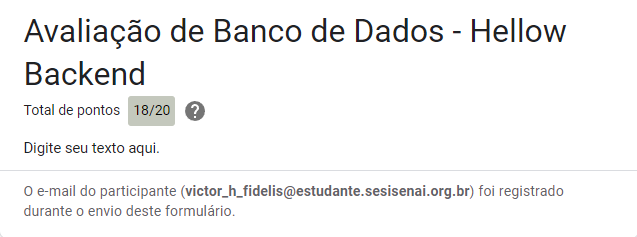

# Diário de Bordo - [Hellow 2024/Trilha DEV Backend]

## Data: [DD-MM-AAA]

### O que aprendi hoje:
****

### O que achei mais difícil:
****

### O que mais gostei:
****

### Sentimento do dia:

---

## Data: [11 e 18-04-2024]

### O que aprendi hoje:
**Aprendi o básico sobre Github, achei interessante, pois não conhecia esse universo de programação.**

### O que achei mais difícil:
**Lembrar dos comandos de git, como git push, etc... Como não faz parte do dia a dia acaba que esqueço isso. Acho o preço dos lanches caros.**

### O que mais gostei:
**Da explicação do professor, de poder conhecer o SENAI, poder vir para o SENAI com meu amigo de escola.**

### Sentimento do dia:

---
## Data: [25-04-2024]

### O que aprendi hoje:
**O básico de como fazer calculos no Java, como fazer o diário de Bordo.**

### O que achei mais difícil:
**Entender a como fazer calculos no Java, uma certa dificuldade sobre os tipos de dados.**

### O que mais gostei:
**De entender o básico do básico sobre Java.**

### Sentimento do dia:

---
## Data: [02-05-2024]

### O que aprendi hoje:
**Aprendi mais sobre Java, como códigos que não tinha entendido na aula passada.**

### O que achei mais difícil:
**Até entender os exercícios eu achei difícil, porém depois de um tempo connsegui entender.**

### O que mais gostei:
**De conseguir entender o que era uma duvida.**

### Sentimento do dia:

---
# Diário de Bordo - [Hellow 2024/Trilha DEV Backend]

## Data: [09-05-2024]

### O que aprendi hoje:
**O básico de uma programaçao de um mini jogo.**

### O que achei mais difícil:
**Algumas coisas que eu nao sabia, que ainda nao tinha sido ensinado, e também que não tinhamos entendido.**

### O que mais gostei:
**De poder jogar o jogo que o professor tinha feito, e também, de poder de poder entender um pouco sobre o conteudo, apesar de ter coisas que eu ainda nao entendi.**

### Sentimento do dia:

---
# Diário de Bordo - [Hellow 2024/Trilha DEV Backend]

## Data: [16-05-2024]

### O que aprendi hoje:
**Mais um pouco sobre os jogos.**

### O que achei mais difícil:
**Entender o conteudo.**

### O que mais gostei:
**Podermos jogar tambem, e jogar no pc a vontade.**

### Sentimento do dia:

---
# Diário de Bordo - [Hellow 2024/Trilha DEV Backend]

## Data: [23-05-2024]

### O que aprendi hoje:
**Um pouco sobre os exercicios condicionais.**

### O que achei mais difícil:
**Entender os exercicios, pq não tinha entendido o que era para fazer**

### O que mais gostei:
**De poder ter entendido um pouco mais sobre exercicios condicionais.**

### Sentimento do dia:

---
## Data: [06-06-2024]

### O que aprendi hoje:
**Estrutura de repetição**

### O que achei mais difícil:
**Copiar e fazer os exercicios da aula**

### O que mais gostei:
**Jogar e poder fazer as atividades.**

### Sentimento do dia:

---

## Data: [DD-MM-AAA]

### O que aprendi hoje:
**Aprendi um pouco sobre como jogar um jogo do próprio minecraft que eu nao conhecia**

### O que achei mais difícil:
**fazer um pouco sobre os comandos**

### O que mais gostei:
**Poder Jogar**

### Sentimento do dia:

### Certificado

### Fase que eu mais gostei

---
## Data: [20-06-2024]

### O que aprendi hoje:
**Um pouco sobre banco de dados**

### O que achei mais difícil:
**Fazer os exercicios**

### O que mais gostei:
**conseguir entender um pouco mais sobre banco de dados**

### Exercicio

### Sentimento do dia:

---

# Diário de Bordo - [Hellow 2024/Trilha DEV Backend]

## Data: [DD-MM-AAA]

### O que aprendi hoje:
**Neste momento aprendi a revisar os conceitos SQL**

### O que achei mais difícil:
**Algumas questoes que nao tinha entendido, apos o intervalo finalizamos o exercicio que tinhamos começado na aula passada, algumas queustoes foram complicados**

### O que mais gostei:
**De poder aprender mais um pouco sobre, apos o intervalo gostei de fazer os exercicios**

### Sentimento do dia:

### Exercicios

## Data: [04-07-2024]

### O que aprendi hoje:
**Mais coisas sobre banco de dados**

### O que achei mais difícil:
**Algumas questoes que nao tinham sido explicadas antes**

### O que mais gostei:
**De finalmente poder entender coisas que eu nao tinha entendido no passado**

### Exercicio do dia

### Sentimento do dia:

---