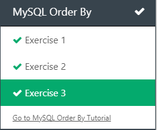
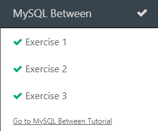

# Diário de Bordo - [Hellow 2024/Trilha DEV Backend]

## Data: [DD-MM-AAA]

### O que aprendi hoje:
Descreva em detalhes o que você aprendeu durante a aula de hoje. Tente ser o mais específico possível, mencionando conceitos, técnicas ou insights que foram importantes para você.

### O que achei mais difícil:
Explique quais partes da aula de hoje foram mais desafiadoras para você e por quê. Isso pode incluir tópicos que você achou complexos, perguntas que permaneceram sem resposta ou habilidades que você sentiu que precisava desenvolver mais.

### O que mais gostei:
Compartilhe o que você mais gostou na aula de hoje. Isso pode ser um tópico específico que foi discutido, uma atividade prática que foi realizada, ou mesmo uma história ou exemplo que o professor compartilhou.

### Sentimento do dia:

Escolha um GIF que melhor represente seu sentimento sobre a aula de hoje. Você pode usar sites como Giphy para encontrar o GIF perfeito.

---
## Data: [11 e 18-04-2024]

### O que aprendi hoje:
Aprendi sobre vários comandos, exemplo:git status, git push, git clone e git log, aprendi a fazer um curriculo, aprendi a mexer no git hub.

### O que achei mais difícil:
eu achei mais difícil os comandos e oq algum deles fazem, também chegar até o senai.

### O que mais gostei:
Gostei muito dos programas, dos professores e fiz amigos novos.

### Sentimento do dia:

Escolha um GIF que melhor represente seu sentimento sobre a aula de hoje. Você pode usar sites como Giphy para encontrar o GIF perfeito.

---
## Data: [25-04-2024]

### O que aprendi hoje:
Aprendi mais alguns comandos no git, aprendi oq são variáveis e algumas contas matemáticas usando comandos no intellij.

### O que achei mais difícil:
Usar o atalho sout.

### O que mais gostei:
Fazer os programas e eprender sobre as variáveis

### Sentimento do dia:

Escolha um GIF que melhor represente seu sentimento sobre a aula de hoje. Você pode usar sites como Giphy para encontrar o GIF perfeito.

---
## Data: [02-05-2024]

### O que aprendi hoje:
Nós fizemos algumas atividades usando o java e seus comandos.

### O que achei mais difícil:
Eu achei copiar as quetões para o java.

### O que mais gostei:
Os programas que nós fizemos.

### Sentimento do dia:

---
## Data: [09-05-2024]

### O que aprendi hoje:
Hoje eu aprendi a fazer operadores booleanos, fizemos alguns exercícios no Intellij e como comparar os resultados das variáveis, se são verdadeiros ou falsos.

### O que achei mais difícil:
Eu achei mais difícil a parte de escrever os comandos e como ultilizar cada operador.

### O que mais gostei:
Eu gostei do jogo, achei muito legal e também fazer as linhas de código.

### Sentimento do dia:

---
## Data: [16-05-2024]

### O que aprendi hoje:
Eu aprendi a como mecher com as estruturas de repetição.

### O que achei mais difícil:
Foi a sala da fechadura na sala dos desafios no comando que o professor mostrou.

### O que mais gostei:
Eu gostei do jogo que fizemos no Intellij.

### Sentimento do dia:

---
## Data: [23-05-2024]

### O que aprendi hoje:
Hoje eu fiz mais questões condicionais no intellij.

### O que achei mais difícil:
O mais difício foi usar os comandos e pontuações corretamente.

### O que mais gostei:
Eu gostei das questões e da dificuldade.

### Sentimento do dia:

---

## Data: [06-06-2024]

### O que aprendi hoje:
Hoje eu aprendi outros meios de mecher com java pelo navegador do google

### O que achei mais difícil:
Nada de mais

### O que mais gostei:
Os sites de programa java no google

### Sentimento do dia:

---
## Data: [13-06-2024]

### O que aprendi hoje:
Hoje eu aprendi sobre estruturas de repetição

### O que achei mais difícil:
fazer os comandos no site que o professor mandou

### O que mais gostei:
O site que tinha o tema de minecraft

### Sentimento do dia:

### Certificado

### Print da fase

---
## Data: [20-06-2024]

### O que aprendi hoje:
Aprendi sobre banco de dados e como eles funcionam.

### O que achei mais difícil:
Entender como funciona os bancos de dados

### O que mais gostei:
Eu gostei dos sites.

### Exercício do dia

### Exercício do dia 2

### Sentimento do dia:

---
## Data: [27-06-2024]

### O que aprendi hoje:
Jogamos um jogo ensinando como funciona os bancos de dados e como separar os dados dentro de cada banco. Ele nos mostra os comandos do SQL:SELECT, WHERE, ORDER BY, ASC, DESC e como cada um funciona.

Depois do intervalo, fomos para o site W3school para aprender novos comandos do SQL.

 
 
 
 
  
 

### O que achei mais difícil:
Lembrar de como funciona cada comando do banco de dados, o order by é um comando que me deu um pouco mais de trabalho.
Depois do intervalo não achei nada muito difícil só ficou um pouco complicado na hora de entender estes comandos mais complexos.

### O que mais gostei:
O jogo que se passa em um futuro apocalíptico e que nos ensina sobre banco de dados.
Depois do intervalo o que eu mais gostei foi como o SQL faz várias funções com poucos comandos.
 
### Sentimento do dia:

---
## Data: [04-07-2024]

### O que aprendi hoje:
Hoje eu aprendi como usar os comandos SUM, MIN, MAX, AVG, COUNT e LIMIT.

### O que achei mais difícil:
Usar corretamente cada comando nos exercícios do Intellij

### O que mais gostei:
Oque eu mais gostei foi os slides sobre os comandos do SQL.

### Sentimento do dia:

### W3school atividades

### Intellij questões

---

## Data: [01-08-2024]

### O que aprendi hoje:
Fizemos uma revisão sobre os comandos java e SQL e usamos inteligência artificial para criar uma imagem e faze-la falar um parágrafo. 

### O que achei mais difícil:
Não achei nada muito difícil.

### O que mais gostei:
Eu gostei da imagens feitas por IA.

### Sentimento do dia:

### Atividades do dia

<audio src="2024-08-01/ttsmaker-file-2024-8-1-16-19-40.mp3" controls title="Title"></audio>

<video src="2024-08-01/d923103c-43ea-4e08-9459-d49497fb24c7.mp4" controls title="Title"></video>
---