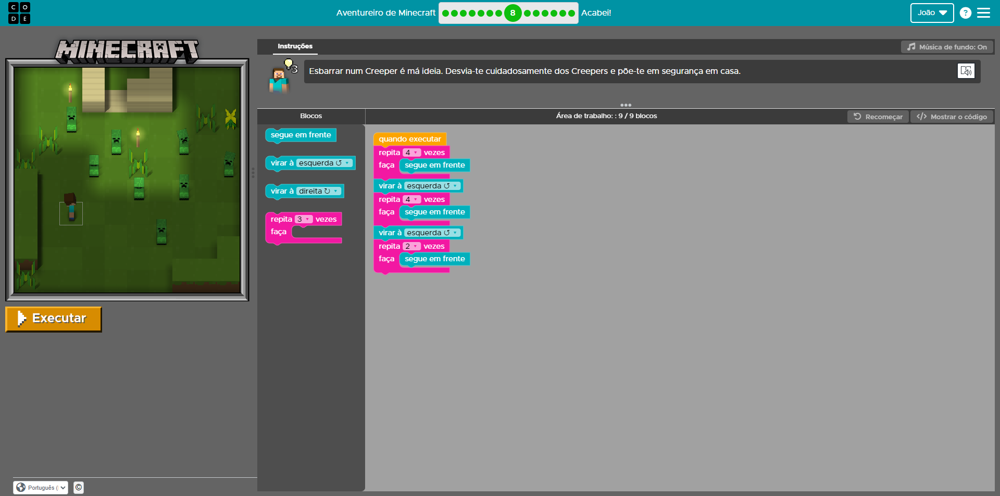

# Diário de Bordo - [Hellow 2024/Trilha DEV Backend]

## Data: [DD-MM-AAA]

### O que aprendi hoje:
Descreva em detalhes o que você aprendeu durante a aula de hoje. Tente ser o mais específico possível, mencionando conceitos, técnicas ou insights que foram importantes para você.

### O que achei mais difícil:
Explique quais partes da aula de hoje foram mais desafiadoras para você e por quê. Isso pode incluir tópicos que você achou complexos, perguntas que permaneceram sem resposta ou habilidades que você sentiu que precisava desenvolver mais.

### O que mais gostei:
Compartilhe o que você mais gostou na aula de hoje. Isso pode ser um tópico específico que foi discutido, uma atividade prática que foi realizada, ou mesmo uma história ou exemplo que o professor compartilhou.

### Sentimento do dia:

Escolha um GIF que melhor represente seu sentimento sobre a aula de hoje. Você pode usar sites como Giphy para encontrar o GIF perfeito.

---

## Data: [11 e 18-04-2024]

### O que aprendi hoje:
criar repositório
clonar repositório
e a usar o git
os comandos: git log, git push, git status,git push origin, git commit -m que muda o nome do arquivo

### O que achei mais difícil:
nada

### O que mais gostei:
gostei de tudo

### Sentimento do dia:

## Data: [25-04-2024]

### O que aprendi hoje:
A progamar com Java
Variaveis 
Classes 
Tipos de dados

### O que achei mais difícil:
Programar com Java

### O que mais gostei:
De aprender a usar java

### Sentimento do dia:

---

## Data: [02-05-2024]

### O que aprendi hoje:
Continuei Apredendo sobre Java 
E fiz uma avaliação sobre Java

### O que achei mais difícil:
Nada

### O que mais gostei:
De aprender sobre Java

### Sentimento do dia:

---
## Data: [09-05-2024]

### O que aprendi hoje:
Mais comandos do Java

### O que achei mais difícil:
nada

### O que mais gostei:
De aprender mais comandos do Java

### Sentimento do dia:

---
## Data: [16-05-2024]

### O que aprendi hoje:
Outros comandos do Java

### O que achei mais difícil:
Nada

### O que mais gostei:
De aprender mais comandos do Java

### Sentimento do dia:

---
## Data: [23-05-2024]

### O que aprendi hoje:
Fiz exercícios de condicionais do JAVA

### O que achei mais difícil:
Nada

### O que mais gostei:
De fazer exercícios de condicionais do JAVA

### Sentimento do dia:

---

## Data: [06-06-2024]

### O que aprendi hoje:
Mais coisas sobre Java

### O que achei mais difícil:
Nada

### O que mais gostei:
Tudo
### Sentimento do dia:

---
## Data: [13-06-2024]

### O que aprendi hoje:
Estrutura de repetição

### O que achei mais difícil:
nada

### O que mais gostei:
tudo

### Sentimento do dia:

### Certificado

### Fase que eu gostei

---

## Data: [20-06-2024]

### O que aprendi hoje:
Sobre banco de dados

### O que achei mais difícil:
Nada

### O que mais gostei:
Tudo
### Sentimento do dia:

---