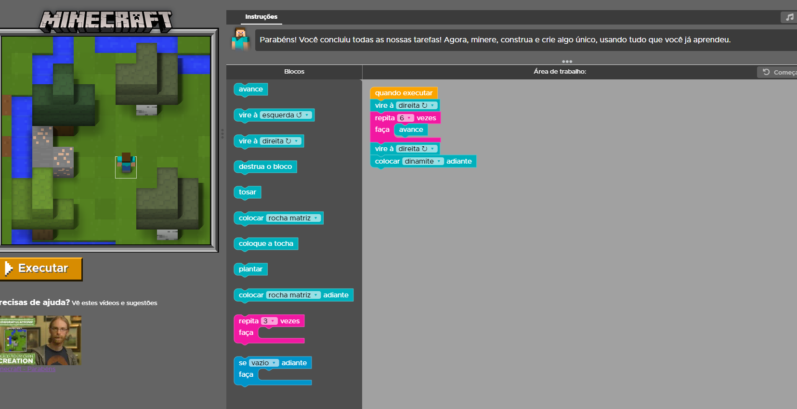
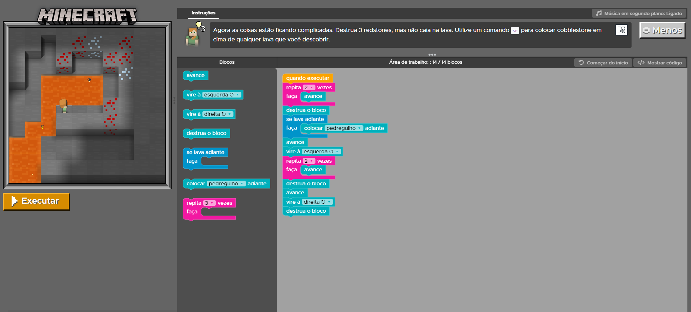
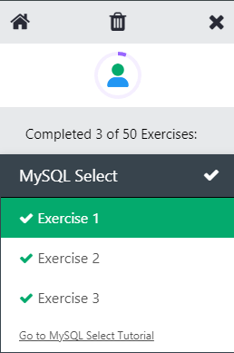
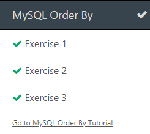
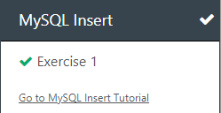
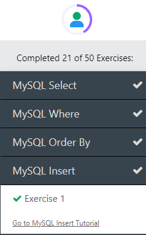
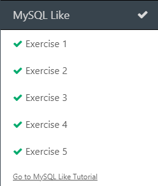
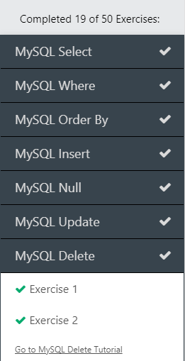
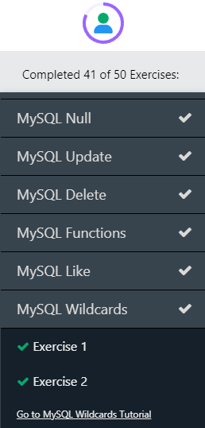

# Diário de Bordo - [Hellow 2024/Trilha DEV Backend]

## Data: [DD-MM-AAA]

### O que aprendi hoje:
Descreva em detalhes o que você aprendeu durante a aula de hoje. Tente ser o mais específico possível, mencionando conceitos, técnicas ou insights que foram importantes para você.

### O que achei mais difícil:
Explique quais partes da aula de hoje foram mais desafiadoras para você e por quê. Isso pode incluir tópicos que você achou complexos, perguntas que permaneceram sem resposta ou habilidades que você sentiu que precisava desenvolver mais.

### O que mais gostei:
Compartilhe o que você mais gostou na aula de hoje. Isso pode ser um tópico específico que foi discutido, uma atividade prática que foi realizada, ou mesmo uma história ou exemplo que o professor compartilhou.

### Sentimento do dia:

Escolha um GIF que melhor represente seu sentimento sobre a aula de hoje. Você pode usar sites como Giphy para encontrar o GIF perfeito.
---

## Data: [11 e 18-04-24]

### O que aprendi hoje:
aprendi alguns comandos do terminal envolvendo a "minha pasta", além de criar meu currículo com gifs e informações minhas no Visual Code. ( além de alguns comandos git -u- ) 

### O que achei mais difícil:
Não achei nada de fato "complexo", apenas tive um mini problema com Alt+f4 no meu terminal, mas consegui recuperar o conteúdo. Aliás, a inflação do lanche no Senai é muito alta.

### O que mais gostei:
Gostei da aula, principalmente sobre o git. Gostei BASTANTE de criar amizades a partir do jogo do google kour.io. Sinseramente, odiei o lanche pois achei muito incompleto e que com certeza n enche praticamente nada, fazendo com que fiquemos com fome e possívelmente ( Não estou falando que é com esse intuito) comprar mais alguma coisa.

### Sentimento do dia:
Eu ao ver o preço do pão de queijo:**

---
# Diário de Bordo - [Hellow 2024/Trilha DEV Backend]

## Data: [18-04-2024]

### O que aprendi hoje:
aprendi comando no terminal, além de demasiados comandos Java, ex: criar variáveis com int = numeros inteiros
double = números decimais
flout = números decimais pequenos
long = números inteiros gigantes
criar cauculadoras em Java, além de criar projetos e sua linguagem geral.
além de algumas regras basicas como o ponto e vírgula(;) sempre ter que ficar na frente dos comandos para executá-los. 
palavras únicas com letra inicial minúscula, apenas a segunda deverá ser escrita com maiúsculo, além de ter que ser escrita junta à primeira palavra.

### O que achei mais difícil:
Pagar 7 reais em um folhado.

### O que mais gostei:
comi um folhado de chocolate, mó bom.

### Sentimento do dia:
Eu ao ver o pão de queijo:

---

# Diário de Bordo - [Hellow 2024/Trilha DEV Backend]

## Data: [02-05-2024]

### O que aprendi hoje:
fizemos uma avaliação com 20 perguntas.

### O que achei mais difícil:
colocar no git

### O que mais gostei:
tudo

### Sentimento do dia:
Eu ao ver que o pão de queijo ficou mais barato:

## Data: [09-05-2024]

### O que aprendi hoje:
a fazer joguinho👍

### O que achei mais difícil:
comer aquele concreto com queijo

### O que mais gostei:
ver minha irmã antes de vir pro senai

### Sentimento do dia:
eu comendo concreto com queijo:

## Data: [16-05-2024]

### O que aprendi hoje:
a fazer joguinho difícil e a burlar os sistemas do professor😎

### O que achei mais difícil:
aguentar 4 babacas no intervalo.

### O que mais gostei:
ter comprado mais uma lata de coca para a minha coleção(e uma coca de vidro❤️❤️❤️)

### Sentimento do dia:
eu comendo pão com queijo derretido:

## Data: [16-05-2024]

### O que aprendi hoje:
System.out.println("ponto e vírgula é importante.);

### O que achei mais difícil:
fazer os exercícios.

### O que mais gostei:
comer.

### Sentimento do dia:
eu comendo pão com queijo derretido:

## Data: [6-06-2024]

### O que aprendi hoje:
alguns exercicios apenas

### O que achei mais difícil:
fazer os exercícios.

### O que mais gostei:
comer.

### Sentimento do dia:
eu comendo pão com queijo derretido:

## Data: [13-05-2024]

### O que aprendi hoje:
programar no minecraft

### O que achei mais difícil:
exercício 8.

### O que mais gostei:
comer.

### Sentimento do dia:

## Data: [20-06-2024]

### O que aprendi hoje:
                                 

### O que achei mais difícil:
gastar 20 reais em um guaraná. (zueira. foi o commit.)

### O que mais gostei:
fazer lanchASSO com o Renan, irionir e o Usuário de discord.

### Sentimento do dia: alegria

## Data: [20-06-2024]

### O que aprendi hoje:
O jogo da investigação futurista, revisa SQL.

### O que achei mais difícil:
o commit.

### O que mais gostei:
comer e jogar

### Sentimento do dia: alegria

## Data: [04-07-2024]

### O que aprendi hoje:
Fiz um questionário 

### O que achei mais difícil:
Explique quais partes da aula de hoje foram mais desafiadoras para você e por quê. Isso pode incluir tópicos que você achou complexos, perguntas que permaneceram sem resposta ou habilidades que você sentiu que precisava desenvolver mais.

### O que mais gostei:
Compartilhe o que você mais gostou na aula de hoje. Isso pode ser um tópico específico que foi discutido, uma atividade prática que foi realizada, ou mesmo uma história ou exemplo que o professor compartilhou.

### Sentimento do dia:

Escolha um GIF que melhor represente seu sentimento sobre a aula de hoje. Você pode usar sites como Giphy para encontrar o GIF perfeito.
---

## Data: [01/08/2024]

### O que aprendi hoje:
revisão de conceitos lógicos e a fazer videos IA

### Atividades do dia
<video src="520cf523-315f-42e4-ac09-9c3c4685f69a%20(14).mp4" controls title="Title"></video>

### O que achei mais difícil:
revisão de conceitos lógicos e a fazer videos IA

### O que mais gostei:
revisão de conceitos lógicos e a fazer videos IA

### Sentimento do dia:

Escolha um GIF que melhor represente seu sentimento sobre a aula de hoje. Você pode usar sites como Giphy para encontrar o GIF perfeito.

## Data: [15/08/2024]

### O que aprendi hoje:
programação é importante em muitas areas

### Atividades do dia
ficar fora da sala

### O que mais gostei:
oculos VR!!!!

### Sentimento do dia:

Escolha um GIF que melhor represente seu sentimento sobre a aula de hoje. Você pode usar sites como Giphy para encontrar o GIF perfeito.

---

