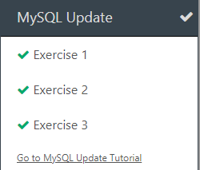

# Diário de Bordo - [Hellow 2024/Trilha DEV Backend]

## Data: [DD-MM-AAA]

### O que aprendi hoje:
Descreva em detalhes o que você aprendeu durante a aula de hoje. Tente ser o mais específico possível, mencionando conceitos, técnicas ou insights que foram importantes para você.

### O que achei mais difícil:
Explique quais partes da aula de hoje foram mais desafiadoras para você e por quê. Isso pode incluir tópicos que você achou complexos, perguntas que permaneceram sem resposta ou habilidades que você sentiu que precisava desenvolver mais.

### O que mais gostei:
Compartilhe o que você mais gostou na aula de hoje. Isso pode ser um tópico específico que foi discutido, uma atividade prática que foi realizada, ou mesmo uma história ou exemplo que o professor compartilhou.

### Sentimento do dia:

Escolha um GIF que melhor represente seu sentimento sobre a aula de hoje. Você pode usar sites como Giphy para encontrar o GIF perfeito.

---
## Data: [11 e 18-04-2024]

### O que aprendi hoje:
como usar o github mesmo com dificuldades

### O que achei mais difícil:
entender e lembrar oque cada comando faz

### O que mais gostei:
da explicaçao do professor

### Sentimento do dia:

---

## Data: [25-04-2024]

### O que aprendi hoje:
**O basico sobre calculos no java e como fazer o diario de bordo**

### O que achei mais difícil:
**Lembrar e enterder como cada comando funciona**

### O que mais gostei:
**como nao é tao dificil quanto parece**

### Sentimento do dia:

---

## Data: [02-05-2024]

### O que aprendi hoje:
**Aprendi a fazer codigos no java**

### O que achei mais difícil:
**Nada**

### O que mais gostei:
**Ter conseguidos fazer as ativades sem problemas**

### Sentimento do dia:

---
## Data: [DD-MM-AAA]

### O que aprendi hoje:
**O basico sobre um programa de um mini jogo**

### O que achei mais difícil:
**Entender os comandos e como executalos**

### O que mais gostei:
**Jogar o mini jogo**

### Sentimento do dia:

---
# Diário de Bordo - [Hellow 2024/Trilha DEV Backend]

## Data: [16-05-2024]

### O que aprendi hoje:
**Nada**
### O que achei mais difícil:
**Entender o conteudo**

### O que mais gostei:
**Jogar**

### Sentimento do dia:

---
# Diário de Bordo - [Hellow 2024/Trilha DEV Backend]

## Data: [23-05-2024]

### O que aprendi hoje:
**Um pouco sobre estrutura condicional**

### O que achei mais difícil:
**Entender e aplicar os comandos**

### O que mais gostei:
**Executar com sucesso os comandos**

### Sentimento do dia:

.

---

# Diário de Bordo - [Hellow 2024/Trilha DEV Backend]

## Data: [20-06-2024]

### O que aprendi hoje:
**nada**

### O que achei mais difícil:
**fazer os exercícios**

### O que mais gostei:
**entender como faz os exercicios**

### Sentimento do dia:

### Exercícios do dia:!

.

---

# Diário de Bordo - [Hellow 2024/Trilha DEV Backend]

## Data: [27-06-2024]

### O que aprendi hoje:
**Revisar os conceitos de SQL da aula passada**
, depois do intervalo voltamos a fazer os exercícios da aula anterior.

### O que achei mais difícil:
**entender os exercícios**

### O que mais gostei:
**entender como faz os exercicios**

### Sentimento do dia:

### Exercícios do dia:!

---

---

# Diário de Bordo - [Hellow 2024/Trilha DEV Backend]

## Data: [04-07-2024]

### O que aprendi hoje:
**um pouco sobre os comandos de SQL** 

### O que achei mais difícil:
**entender os exercícios**

### O que mais gostei:
**entender como faz os exercicios**

### Sentimento do dia:

### Exercícios do dia:!

---

# Diário de Bordo - [Hellow 2024/Trilha DEV Backend]

## Data: [11-07-2024]

### O que aprendi hoje:
**NAda** 

### O que achei mais difícil:
**A prova**

### O que mais gostei:
**A nota da prova**

### Sentimento do dia:

### Exercícios do dia:!

---

# Diário de Bordo - [Hellow 2024/Trilha DEV Backend]

## Data: [01-08-2024]

### O que aprendi hoje:
**Usar algumas inteligencias artificiais** 

### O que achei mais difícil:
**A aula foi suave**

### O que mais gostei:
**De ver a intenligencia artificial criando imagens**

### Sentimento do dia:

### Exercícios do dia:!
<video src="fa779be5-0ed5-4c67-8749-3df34cb31f86.mp4" controls title="Title"></video>
<audio src="ttsmaker-file-2024-8-1-16-18-23.mp3" controls title="Title"></audio>
