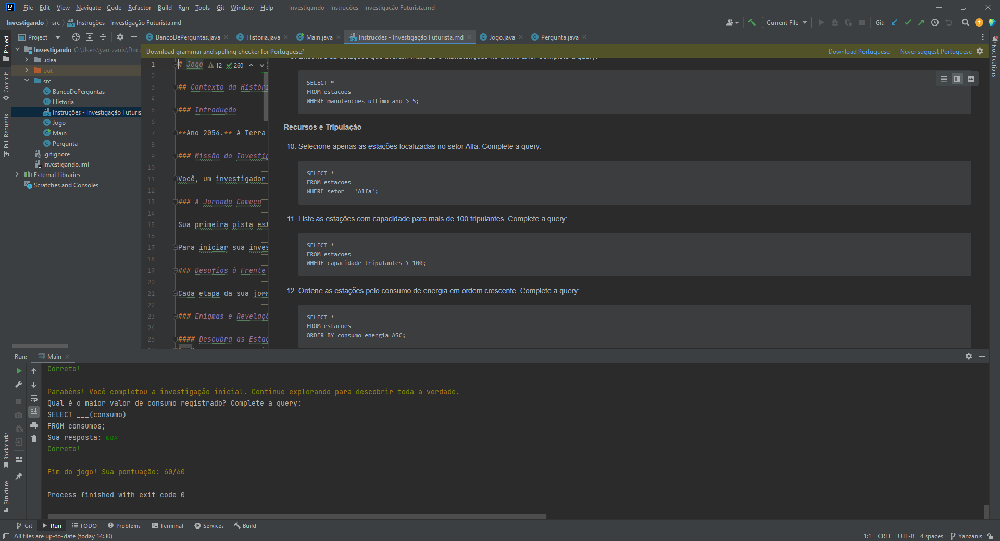

# Diário de Bordo - [Hellow 2024/Trilha DEV Backend]

## Data: [DD-MM-AAA]

### O que aprendi hoje:
Descreva em detalhes o que você aprendeu durante a aula de hoje. Tente ser o mais específico possível, mencionando conceitos, técnicas ou insights que foram importantes para você.

### O que achei mais difícil:
Explique quais partes da aula de hoje foram mais desafiadoras para você e por quê. Isso pode incluir tópicos que você achou complexos, perguntas que permaneceram sem resposta ou habilidades que você sentiu que precisava desenvolver mais.

### O que mais gostei:
Compartilhe o que você mais gostou na aula de hoje. Isso pode ser um tópico específico que foi discutido, uma atividade prática que foi realizada, ou mesmo uma história ou exemplo que o professor compartilhou.

### Sentimento do dia:

Escolha um GIF que melhor represente seu sentimento sobre a aula de hoje. Você pode usar sites como Giphy para encontrar o GIF perfeito.

---
## Data: [11 e 18-04-2024]

### O que aprendi hoje:
Eu aprendi a criar uma conta, a mexer no github, fazer o git push usando o git bash.
### O que achei mais difícil:
A coisa que e eu achei mais dificil foi na parte dos comandos, não lembrei de muita coisa por isso que achei mais dificil.

### O que mais gostei:
De aprender a mexer com o git, para oque ele serve e comandos ou como usar o git

### Sentimento do dia:

---
## Data: [11-04-2024]

### O que aprendi hoje:
Eu aprendi a fazer o login no computador e quais aplicativos que eu iria abrir ao longo do curso

### O que achei mais difícil:
Guardar tudo que aprendi

### O que mais gostei:
De tudo

### Sentimento do dia:

---
## Data: [25-04-2024]

### O que aprendi hoje:
A programar no  Intellig e sobre a linguagem java, oque é variavel e como fazer uma calculadora básica

### O que achei mais difícil:
Só não peguei muito a parte dos números (longo, curdo , etc).E um pouco na parte do ingles (só um pouco).

### O que mais gostei:
Da hora que nós fizemos a calculadora.
### Sentimento do dia:

## Data: [02-05-2024]

### O que aprendi hoje:
A fazer calculos e sobre as variáveis.

### O que achei mais difícil:
Fazer o git bash

### O que mais gostei:
De fazer as atividades, já sabia fazer pelo portugol, mais nunca olhei sobre esse Intellij. 

### Sentimento do dia:

---
## Data: [09-05-2024]

### O que aprendi hoje:
Aprendi a usar o comendo "else", "void", "&&", "||" e else if

### O que achei mais difícil:
memorisar todos, quase memorisei tudo 

### O que mais gostei:
De fazer o exercisio condicional
### Sentimento do dia:

---
## Data: [DD-MM-AAA]

### O que aprendi hoje:
Aprendi sobre o jogo que o professor fez

### O que achei mais difícil:
A entender as estruturas de repetção

### O que mais gostei:
De aprender como funciona do jogo do professor

### Sentimento do dia:

---
# Diário de Bordo - [Hellow 2024/Trilha DEV Backend]

## Data: [23-05-2024]

### O que aprendi hoje:
A usar o else if, if e else
### O que achei mais difícil:
Aprender esses comandos e fazer as atividades
### O que mais gostei:
Eu gostei mais de tentar aprender a fazer as atividades
### Sentimento do dia:

---
# Diário de Bordo - [Hellow 2024/Trilha DEV Backend]

## Data: [13-06-2024]

### O que aprendi hoje:
A ''programar'' pelo jogo do minecraft, usei o if e os comandos de bloco.
### O que achei mais difícil:
Fazer as fases em 100%, complicado.

### O que mais gostei:
De programar o trageto do pesonagem do jogo

### Sentimento do dia:

### Oque eu mais gostei

---

