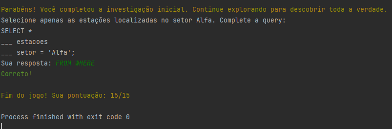
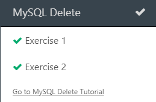

# Diário de Bordo - [Hellow 2024/Trilha DEV Backend]

## Data: [DD-MM-AAA]

### O que aprendi hoje:
Descreva em detalhes o que você aprendeu durante a aula de hoje. Tente ser o mais específico possível, mencionando conceitos, técnicas ou insights que foram importantes para você.

### O que achei mais difícil:
Explique quais partes da aula de hoje foram mais desafiadoras para você e por quê. Isso pode incluir tópicos que você achou complexos, perguntas que permaneceram sem resposta ou habilidades que você sentiu que precisava desenvolver mais.

### O que mais gostei:
Compartilhe o que você mais gostou na aula de hoje. Isso pode ser um tópico específico que foi discutido, uma atividade prática que foi realizada, ou mesmo uma história ou exemplo que o professor compartilhou.

### Sentimento do dia:

Escolha um GIF que melhor represente seu sentimento sobre a aula de hoje. Você pode usar sites como Giphy para encontrar o GIF perfeito.

---
 Data: [11-04-2024]

### O que aprendi hoje:
Aprendi o git log, git push, git pull, git clone, e estamos fazendo o curriculo sobre nós e aprendendo a usar o git hub

### O que achei mais difícil:
Fazer os comandos. 
### O que mais gostei:
de usar o git 

### Sentimento do dia:

Escolha um GIF que melhor represente seu sentimento sobre a aula de hoje. Você pode usar sites como Giphy para encontrar o GIF perfeito.

---
## Data: [25-04-2024]

### O que aprendi hoje:
aprendi variaveis sobre o java 
### O que achei mais difícil:
aprender sobre o que cada codigo faz 

### O que mais gostei:
aprender a usar o java

### Sentimento do dia:

Escolha um GIF que melhor represente seu sentimento sobre a aula de hoje. Você pode usar sites como Giphy para encontrar o GIF perfeito.

---
## Data: [02-05-2024]

### O que aprendi hoje:
aprendi a mexer int, double, System, String, char, booblean

### O que achei mais difícil:
descobrir o que cada codigos faz.

### O que mais gostei:
Tudo.

### Sentimento do dia:

Escolha um GIF que melhor represente seu sentimento sobre a aula de hoje. Você pode usar sites como Giphy para encontrar o GIF perfeito.

---
## Data: [09/05/2024]
### O que aprendi hoje:
Scanner, else if, else, fazer umas perguntas usando esses comandos.

### O que achei mais difícil:
Nada

### O que mais gostei:
A parte das perguntas que o prof passou

### Sentimento do dia:

Escolha um GIF que melhor represente seu sentimento sobre a aula de hoje. Você pode usar sites como Giphy para encontrar o GIF perfeito.

---

## Data: [13/06/24]

### O que aprendi hoje:
Sobre os comandos para passar no jogo do mine

### O que achei mais difícil:
Nao achei nada dificil

### O que mais gostei:
Das fases do jogo
### Sentimento do dia:

Escolha um GIF que melhor represente seu sentimento sobre a aula de hoje. Você pode usar sites como Giphy para encontrar o GIF perfeito.

### Certificado

### Print da Fase

---

## Data: [20/06/2024]

### O que aprendi hoje:
Um pouco sobre SQL

### O que achei mais difícil:
Nada

### O que mais gostei:
Sobre as atividades do SQL

### Exercicios do dia

### Sentimento do dia:

Escolha um GIF que melhor represente seu sentimento sobre a aula de hoje. Você 
pode usar sites como Giphy para encontrar o GIF perfeito.

---

## Data: [27/06/2024]

### O que aprendi hoje:
jogos sobre sql, dps do intervalo 

### O que achei mais difícil:
alguns codigos

### O que mais gostei:
de aprender mais sobre o sql

### Sentimento do dia:

Escolha um GIF que melhor represente seu sentimento sobre a aula de hoje. Você pode usar sites como Giphy para encontrar o GIF perfeito.

---

exercicios do dia

SQL order by

 

SQL Insert

SQL Null

SQL Update

SQL Delet

SQL Functions

SQL Like

SQL Wildcards

SQL In

SQL Between

SQL Alias

SQL Join

SQL GRoup By

SQL Database

