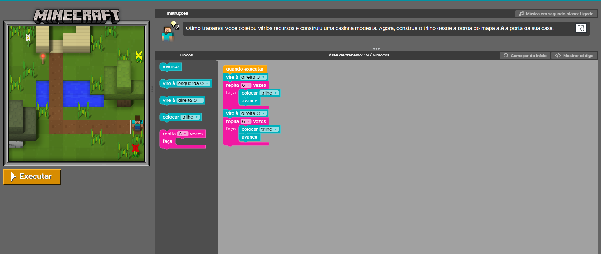
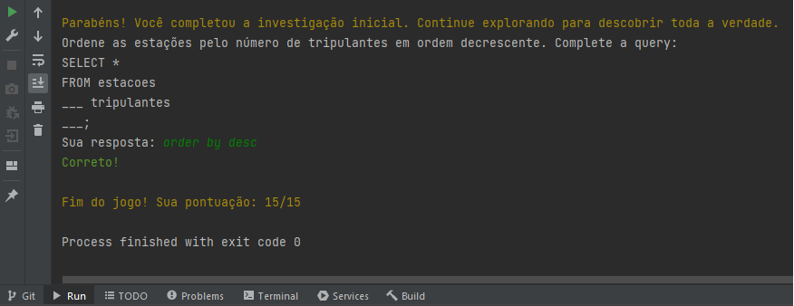
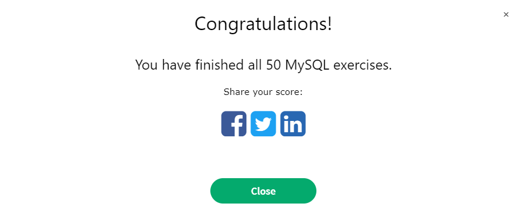
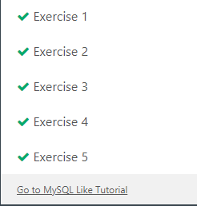

# Diário de Bordo - [Hellow 2024/Trilha DEV Backend]

## Data: [DD-MM-AAA]

### O que aprendi hoje:
Descreva em detalhes o que você aprendeu durante a aula de hoje. Tente ser o mais específico possível, mencionando conceitos, técnicas ou insights que foram importantes para você.

### O que achei mais difícil:
Explique quais partes da aula de hoje foram mais desafiadoras para você e por quê. Isso pode incluir tópicos que você achou complexos, perguntas que permaneceram sem resposta ou habilidades que você sentiu que precisava desenvolver mais.

### O que mais gostei:
Compartilhe o que você mais gostou na aula de hoje. Isso pode ser um tópico específico que foi discutido, uma atividade prática que foi realizada, ou mesmo uma história ou exemplo que o professor compartilhou.

### Sentimento do dia:

Escolha um GIF que melhor represente seu sentimento sobre a aula de hoje. Você pode usar sites como Giphy para encontrar o GIF perfeito.

---
## Data: [11 e 18-04-2024]

### O que aprendi hoje:
Descreva em detalhes o que você aprendeu durante a aula de hoje. Tente ser o mais específico possível, mencionando conceitos, técnicas ou insights que foram importantes para você.
Aprendi a Clonar o repositório, como salvar registrar mudanças e enviar a minha branch e no repositório online.

### O que achei mais difícil:
Explique quais partes da aula de hoje foram mais desafiadoras para você e por quê. Isso pode incluir tópicos que você achou complexos, perguntas que permaneceram sem resposta ou habilidades que você sentiu que precisava desenvolver mais.
Não achei nada muito dificil, não achei nada muito dificil, só tinha algumas duvidas que o professor me ensinou a como fazer as coisas que eu não sabia. Só não curti de algumas vezes onde eu terminava primeiro que muitos e eu tinha que ficar esperando pois alguns alunos tavam tendo ajuda do professor e era muitos, mas eu entendo que eles tem suas duvidas e que não são os genio da lampada.

### O que mais gostei:
Compartilhe o que você mais gostou na aula de hoje. Isso pode ser um tópico específico que foi discutido, uma atividade prática que foi realizada, ou mesmo uma história ou exemplo que o professor compartilhou.
Gostei da experiencia, achei daora fazer as coisas na pratica.

### Sentimento do dia:

Escolha um GIF que melhor represente seu sentimento sobre a aula de hoje. Você pode usar sites como Giphy para encontrar o GIF perfeito.

---

## Data: [25-04-2024]

### O que aprendi hoje:
Descreva em detalhes o que você aprendeu durante a aula de hoje. Tente ser o mais específico possível, mencionando conceitos, técnicas ou insights que foram importantes para você.
eu aprendi a fazer variaveis no Java

### O que achei mais difícil:
Explique quais partes da aula de hoje foram mais desafiadoras para você e por quê. Isso pode incluir tópicos que você achou complexos, perguntas que permaneceram sem resposta ou habilidades que você sentiu que precisava desenvolver mais.
Nada

### O que mais gostei:
Compartilhe o que você mais gostou na aula de hoje. Isso pode ser um tópico específico que foi discutido, uma atividade prática que foi realizada, ou mesmo uma história ou exemplo que o professor compartilhou.
Fazer a variavel na pratica

### Sentimento do dia:

Escolha um GIF que melhor represente seu sentimento sobre a aula de hoje. Você pode usar sites como Giphy para encontrar o GIF perfeito.

---

## Data: [09-05-2024]

### O que aprendi hoje:
Descreva em detalhes o que você aprendeu durante a aula de hoje. Tente ser o mais específico possível, mencionando conceitos, técnicas ou insights que foram importantes para você.
Hoje, eu aprendi a usar as estruturas condicionais.

### O que achei mais difícil:
Explique quais partes da aula de hoje foram mais desafiadoras para você e por quê. Isso pode incluir tópicos que você achou complexos, perguntas que permaneceram sem resposta ou habilidades que você sentiu que precisava desenvolver mais.
Lembrar quando usar certas coisa, mas isso é por falta de pratica.

### O que mais gostei:
Compartilhe o que você mais gostou na aula de hoje. Isso pode ser um tópico específico que foi discutido, uma atividade prática que foi realizada, ou mesmo uma história ou exemplo que o professor compartilhou.
O resultado, mostrado no terminal. Eu gostei do jogo do professor muito maneiro 👍🤠

### Sentimento do dia:

Escolha um GIF que melhor represente seu sentimento sobre a aula de hoje. Você pode usar sites como Giphy para encontrar o GIF perfeito.

---

# Diário de Bordo - [Hellow 2024/Trilha DEV Backend]

## Data: [16-05-2024]

### O que aprendi hoje:
Descreva em detalhes o que você aprendeu durante a aula de hoje. Tente ser o mais específico possível, mencionando conceitos, técnicas ou insights que foram importantes para você.
Hoje eu aprendi e vi as estruturas de repetição

### O que achei mais difícil:
Explique quais partes da aula de hoje foram mais desafiadoras para você e por quê. Isso pode incluir tópicos que você achou complexos, perguntas que permaneceram sem resposta ou habilidades que você sentiu que precisava desenvolver mais.
Hoje por fazer praticamnete nada, falo que não achei nada dificil.

### O que mais gostei:
Compartilhe o que você mais gostou na aula de hoje. Isso pode ser um tópico específico que foi discutido, uma atividade prática que foi realizada, ou mesmo uma história ou exemplo que o professor compartilhou.
Jogo do professor.

### Sentimento do dia:

Escolha um GIF que melhor represente seu sentimento sobre a aula de hoje. Você pode usar sites como Giphy para encontrar o GIF perfeito.

---

## Data: [23-05-2024]

### O que aprendi hoje:
Descreva em detalhes o que você aprendeu durante a aula de hoje. Tente ser o mais específico possível, mencionando conceitos, técnicas ou insights que foram importantes para você.
Hoje eu fiz Exercicios das condicionais e Exercicios das variaveis.

### O que achei mais difícil:
Explique quais partes da aula de hoje foram mais desafiadoras para você e por quê. Isso pode incluir tópicos que você achou complexos, perguntas que permaneceram sem resposta ou habilidades que você sentiu que precisava desenvolver mais.
Elaborar perguntas para ser feitas no terminal.

### O que mais gostei:
Compartilhe o que você mais gostou na aula de hoje. Isso pode ser um tópico específico que foi discutido, uma atividade prática que foi realizada, ou mesmo uma história ou exemplo que o professor compartilhou.
Fazer os codigos.

### Sentimento do dia:

Escolha um GIF que melhor represente seu sentimento sobre a aula de hoje. Você pode usar sites como Giphy para encontrar o GIF perfeito.

---

# Diário de Bordo - [Hellow 2024/Trilha DEV Backend]

## Data: [06-06-2024]

### O que aprendi hoje:
Descreva em detalhes o que você aprendeu durante a aula de hoje. Tente ser o mais específico possível, mencionando conceitos, técnicas ou insights que foram importantes para você.
Hoje demos uma reforçada no while e for.

### O que achei mais difícil:
Explique quais partes da aula de hoje foram mais desafiadoras para você e por quê. Isso pode incluir tópicos que você achou complexos, perguntas que permaneceram sem resposta ou habilidades que você sentiu que precisava desenvolver mais.
Não achei nada muito dificil.

### O que mais gostei:
Compartilhe o que você mais gostou na aula de hoje. Isso pode ser um tópico específico que foi discutido, uma atividade prática que foi realizada, ou mesmo uma história ou exemplo que o professor compartilhou.
De fazer o codigo e resolver os problemas.

### Sentimento do dia:

Escolha um GIF que melhor represente seu sentimento sobre a aula de hoje. Você pode usar sites como Giphy para encontrar o GIF perfeito.

---

## Data: [13-06-2024]

### O que aprendi hoje:
Descreva em detalhes o que você aprendeu durante a aula de hoje. Tente ser o mais específico possível, mencionando conceitos, técnicas ou insights que foram importantes para você.
Eu aprendi estruturas condicionais e estruturas de repetição.

### O que achei mais difícil:
Explique quais partes da aula de hoje foram mais desafiadoras para você e por quê. Isso pode incluir tópicos que você achou complexos, perguntas que permaneceram sem resposta ou habilidades que você sentiu que precisava desenvolver mais.
Não achei nada muito de dificil.

### O que mais gostei:
Compartilhe o que você mais gostou na aula de hoje. Isso pode ser um tópico específico que foi discutido, uma atividade prática que foi realizada, ou mesmo uma história ou exemplo que o professor compartilhou.
Da parte da pratica.

### Sentimento do dia:

Escolha um GIF que melhor represente seu sentimento sobre a aula de hoje. Você pode usar sites como Giphy para encontrar o GIF perfeito.

### Certificado

---

# Diário de Bordo - [Hellow 2024/Trilha DEV Backend]

## Data: [20-06-2024]

### O que aprendi hoje:

Introdução ao banco de dados

### O que achei mais difícil:
Nada.

### O que mais gostei:
Fazer os exercícios.

### Exercícios do dia

---

### Sentimento do dia:

# Diário de Bordo - [Hellow 2024/Trilha DEV Backend]

## Data: [27-06-2024]

### O que aprendi hoje:
Revizar os conceitos de SQL da aula passada, após ao intervalo, nós entramos na plataforma w3school e completamos as atividades

### O que achei mais difícil:
a fase: Verifique as estações que têm capacidade para mais de 100 tripulantes.
Liste as estações offline por ordem de última manutenção. No w3School achei nada muito dificil

### O que mais gostei:
Eu curti de fazer as atividades na pratica.

### Sentimento do dia:

## Exercícios do dia

---

# Diário de Bordo - [Hellow 2024/Trilha DEV Backend]

## Data: [04-07-2024]

### O que aprendi hoje:
Hoje eu revi em forma de exercicios o que aprendi na aula passada pelo w3school.

### O que achei mais difícil:
ao iniciar as atividades eu achei dificil a parte de selecionar a certa pasta, registro, arquivos ou quantidade dessas coisas, achei dificil achar os nomes dessas coisas assim.

### O que mais gostei:
quando eu peguei o jeito de fazer, quando eu achei a logica.

### Sentimento do dia:

Escolha um GIF que melhor represente seu sentimento sobre a aula de hoje. Você pode usar sites como Giphy para encontrar o GIF perfeito.

### Exercícios do dia

---

## Data: [01-08-2024]

### O que aprendi hoje:
Hoje fizemos a revisão de todos os assuntos que apredemos anteriormente, além que demos uma brincada usando a inteligencia artificial

### O que achei mais difícil:
em relação a tudo não achei nada muito dificil.

### O que mais gostei:
Fazer o video usando inteligencia artificial

### Sentimento do dia:

Escolha um GIF que melhor represente seu sentimento sobre a aula de hoje. Você pode usar sites como Giphy para encontrar o GIF perfeito.

### Atividade do Dia
.jpg>)
.jpg>)
<video src="2024-08-01/AIAtividade.mp4" controls title="Title"></video>

---