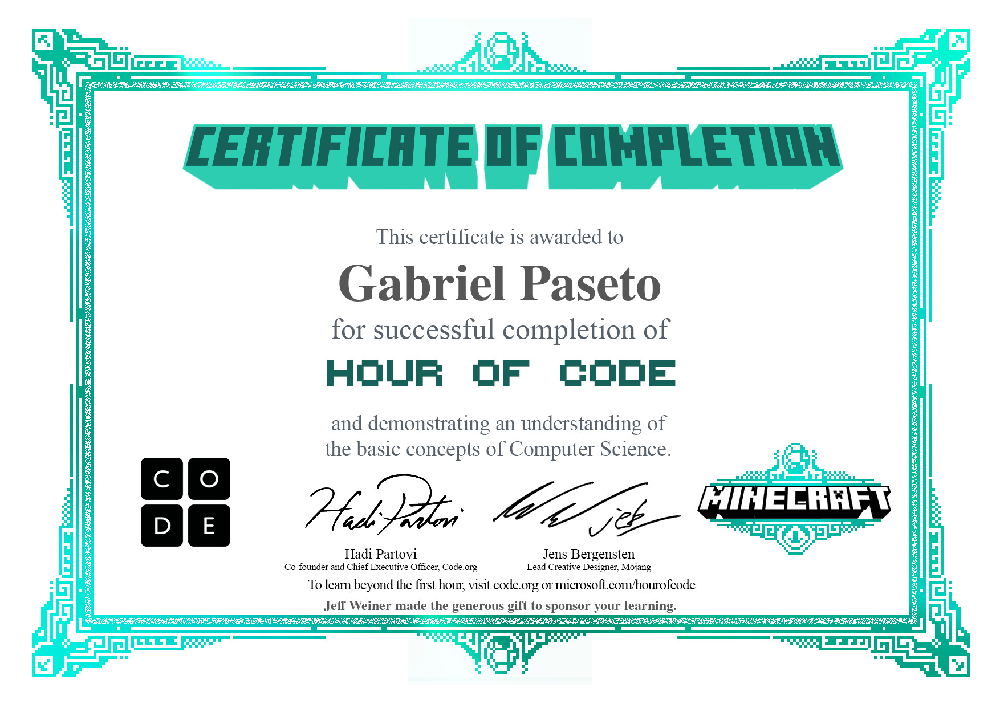
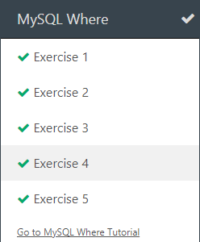

# Diário de Bordo - [Hellow 2024/Trilha DEV Backend]

## Data: [DD-MM-AAA]

### O que aprendi hoje:
Descreva em detalhes o que você aprendeu durante a aula de hoje. Tente ser o mais específico possível, mencionando conceitos, técnicas ou insights que foram importantes para você.

### O que achei mais difícil:
Explique quais partes da aula de hoje foram mais desafiadoras para você e por quê. Isso pode incluir tópicos que você achou complexos, perguntas que permaneceram sem resposta ou habilidades que você sentiu que precisava desenvolver mais.

### O que mais gostei:
Compartilhe o que você mais gostou na aula de hoje. Isso pode ser um tópico específico que foi discutido, uma atividade prática que foi realizada, ou mesmo uma história ou exemplo que o professor compartilhou.

### Sentimento do dia:

Escolha um GIF que melhor represente seu sentimento sobre a aula de hoje. Você pode usar sites como Giphy para encontrar o GIF perfeito.

---
## Data: [11 e 18-04-2024]

### O que aprendi hoje:
Eu aprendi a usar o git Bash Here e a usar alguns comandos basícos.
### O que achei mais difício
Pra mim mais difício foi os codigos pois tem que decorar e por isso acaba sendo mais complicado.

### O que mais gostei:
Eu achei legal usar os comandos do Git pois você consegue abrir varias coisas, salvar e etc.

### Sentimento do dia:

## Data: [25-04-2024]

### O que aprendi hoje:
hoje nós começamos a programar uma calculadora e começamos o nosso diário de bordo.

### O que achei mais difícil:
eu achei bem complexo programar a calculadora pois tem que montar.

### O que mais gostei:
Eu gostei mais de fazer o Diário de bordo.

### Sentimento do dia:

## Data: [02-05-2024]

### O que aprendi hoje:
Hoje fizemos uma prova, ela foi feita no Intellij IDEA.

### O que achei mais difícil:
hoje não teve nada tão difício, eu achei mais de boa.

### O que mais gostei:
Eu gostei mais de fazer a prova.

### Sentimento do dia:

## Data: [09-05-2024]

### O que aprendi hoje:
hoje fizemos algumas atividades com o Java e vimos um jogo que o Professor fez o nome é Decida o caminho.

### O que achei mais difícil:
Nada.
### O que mais gostei:
Eu gostei de tudo principalmente o jogo.
### Sentimento do dia:

## Data: [16-05-2024]

### O que aprendi hoje:
Hoje nos jogamos outro jogo que o professor programou.

### O que achei mais difícil:
Não fizemos nenhuma atividade então não achei nada difício.

### O que mais gostei:
eu gostei de jogar o jogo tava bem legal.

### Sentimento do dia:

## Data: [23-05-2024]

### O que aprendi hoje:
Hoje nós fizemos algumas atividades no Intellij IDEA.

### O que achei mais difícil:
Eu achei tudo um pouco difício poius é algo novo então a tendencia é ser mais complicado de fazer.

### O que mais gostei:
Fazer a atividade pode ser um pouco difício mais é legal.

### Sentimento do dia:

## Data: [06-06-2024]

### O que aprendi hoje:
Hoje relembramos a estrutura de repetição e fizemos compiladores de java online

### O que achei mais difícil:
não teve nada difício
### O que mais gostei:
Eu gostei de fazer a estrutura de repetição

### Sentimento do dia:

## Data: [13-06-2024]

### O que aprendi hoje:
Hoje nós jogamos um tipo de Minecreft 2D que tinha que colocar comandos para ele sair do lugar. 

### O que achei mais difícil:
Eu achei difício de fazer os comandos, por que se vc desviasse a atenção tinha que procurar onde vc tava ai ficava mais complicado.
### O que mais gostei:
Foi de jogar o Minecreft

### Sentimento do dia:

### Certificado

### Fase que eu mais gostei

## Data: [20-06-2024]

### O que aprendi hoje:
Hoje eu aprendi sobre Banco de Dados.

### O que achei mais difícil:
nada
### O que mais gostei:
Eu gostei das atividades do My W3Shools.

### Sentimento do dia:

## Data: [27-06-2024]

### O que aprendi hoje:
Hoje jogamos um jogo que o Professor fez.

### O que achei mais difícil:
As perguntas estavão bem complicadas. 

### O que mais gostei:
A História do jogo.

### Depois do intervalo fizemos a atividade W3 school sobre SQR.

### Sentimento do dia:
