# Diário de Bordo - [Hellow 2024/Trilha DEV Backend]

## Data: [DD-MM-AAA]

### O que aprendi hoje:
Descreva em detalhes o que você aprendeu durante a aula de hoje. Tente ser o mais específico possível, mencionando conceitos, técnicas ou insights que foram importantes para você.

### O que achei mais difícil:
Explique quais partes da aula de hoje foram mais desafiadoras para você e por quê. Isso pode incluir tópicos que você achou complexos, perguntas que permaneceram sem resposta ou habilidades que você sentiu que precisava desenvolver mais.

### O que mais gostei:
Compartilhe o que você mais gostou na aula de hoje. Isso pode ser um tópico específico que foi discutido, uma atividade prática que foi realizada, ou mesmo uma história ou exemplo que o professor compartilhou.

### Exercicio do dia

### Sentimento do dia:

Escolha um GIF que melhor represente seu sentimento sobre a aula de hoje. Você pode usar sites como Giphy para encontrar o GIF perfeito.

---
## Data: [11-04-2024]

### O que aprendi hoje:
Descreva em detalhes o que você aprendeu durante a aula de hoje. Tente ser o mais específico possível, mencionando conceitos, técnicas ou insights que foram importantes para você.
Eu aprendi a clonar repositórios, juntamente de registrar mudanças e envia-las para a branch e repositório online.

### O que achei mais difícil:
Explique quais partes da aula de hoje foram mais desafiadoras para você e por quê. Isso pode incluir tópicos que você achou complexos, perguntas que permaneceram sem resposta ou habilidades que você sentiu que precisava desenvolver mais.
Durante a aula não obtive muitas dificuldades, apenas algumas duvidas que foram retiradas durante o processo da aula. As vezes a maior dificuldade pode ser a memorização dos codigos e para oque servem.

### O que mais gostei:
Compartilhe o que você mais gostou na aula de hoje. Isso pode ser um tópico específico que foi discutido, uma atividade prática que foi realizada, ou mesmo uma história ou exemplo que o professor compartilhou.
Oque mais gostei durante a aula foi por as coisas na pratica e adquirir o conhecimento passado durante o ensino e tambem o interagir com o professor Samuel. ily ( I love you ) teacher 

### Sentimento do dia:

Escolha um GIF que melhor represente seu sentimento sobre a aula de hoje. Você pode usar sites como Giphy para encontrar o GIF perfeito.

---
# Diário de Bordo - [Hellow 2024/Trilha DEV Backend]

## Data: [25-04-2024]

### O que aprendi hoje:
Descreva em detalhes o que você aprendeu durante a aula de hoje. Tente ser o mais específico possível, mencionando conceitos, técnicas ou insights que foram importantes para você.
Durante a aula aplicada pelo professor aprendi a fazer variaveis do JAVA

### O que achei mais difícil:
Explique quais partes da aula de hoje foram mais desafiadoras para você e por quê. Isso pode incluir tópicos que você achou complexos, perguntas que permaneceram sem resposta ou habilidades que você sentiu que precisava desenvolver mais.
Na aula minha maior dificuldade foi entender a explicação do que era as variaveis do JAVA, porem na pratica foi mais facil

### O que mais gostei:
Compartilhe o que você mais gostou na aula de hoje. Isso pode ser um tópico específico que foi discutido, uma atividade prática que foi realizada, ou mesmo uma história ou exemplo que o professor compartilhou.
Oque mais me agradou na aula durante o dia foi por as variaveis na pratica.

### Sentimento do dia:

Escolha um GIF que melhor represente seu sentimento sobre a aula de hoje. Você pode usar sites como Giphy para encontrar o GIF perfeito.

------
## Data: [09-05-2024]

### O que aprendi hoje:
Descreva em detalhes o que você aprendeu durante a aula de hoje. Tente ser o mais específico possível, mencionando conceitos, técnicas ou insights que foram importantes para você.
 Na de hoje eu adquiri os conhecimentos de usar estruturas condicionais

### O que achei mais difícil:
Explique quais partes da aula de hoje foram mais desafiadoras para você e por quê. Isso pode incluir tópicos que você achou complexos, perguntas que permaneceram sem resposta ou habilidades que você sentiu que precisava desenvolver mais.
 Durante a aula de hoje minha maior dificuldade foi saber aonde colocar cada comando no Inteljj

### O que mais gostei:
Compartilhe o que você mais gostou na aula de hoje. Isso pode ser um tópico específico que foi discutido, uma atividade prática que foi realizada, ou mesmo uma história ou exemplo que o professor compartilhou.
Gostei muito do jogo que nosso professor Samuel Levi, ILY ( I love you) teacher <3

### Sentimento do dia:

-----

## Data: [16-05-2024]

### O que aprendi hoje:
Hoje durante a aula, observei estrututas de repetição, com o nosso maravilhoso professor fazendo um jogo para a gente.
### O que achei mais difícil:
Novamente, decorar aonde se encaixa cada codigo.
### O que mais gostei:
Do jogo que o nosso professor produziu.

### Sentimento do dia:

------

Data: [23-05-2024]

### O que aprendi hoje:
Exercicos variaveis Java, Exercicios Estruturas condicionais

### O que achei mais difícil:
Os exercicios de estruturas condicionais
### O que mais gostei:
De fazer os Exercicios JAVA
### Sentimento do dia:

Escolha um GIF que melhor represente seu sentimento sobre a aula de hoje. Você pode usar sites como Giphy para encontrar o GIF perfeito.

--------
## Data: [06/06/2024]

### O que aprendi hoje:
While for.
### O que achei mais difícil:
Não teve nada de muito dificil, apenas

### O que mais gostei:
Comer.

### Sentimento do dia:

-------

 Data: [13/06/2024]

### O que aprendi hoje:
Estruturas condicionais e de repetições!

### O que achei mais difícil:
Na aula de hoje oque eu achei mais dificil o exercicio 8.

### O que mais gostei:

### Sentimento do dia:

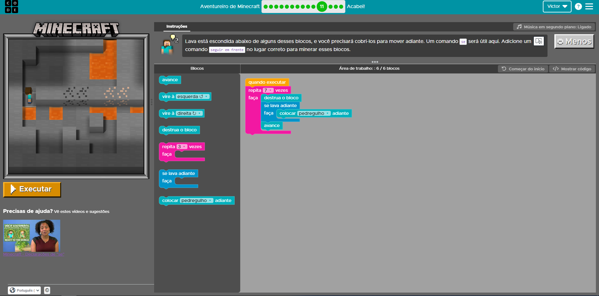

----

## Data: [20-06-2024]

### O que aprendi hoje:
A fazer banco de dados

### O que achei mais difícil:
fazer o MySQL Update

### O que mais gostei:
aprender MySQL

### Exercicio do dia
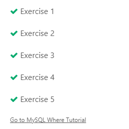
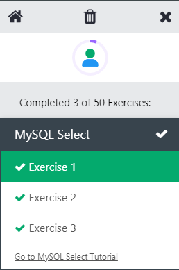
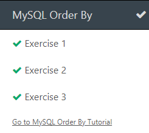
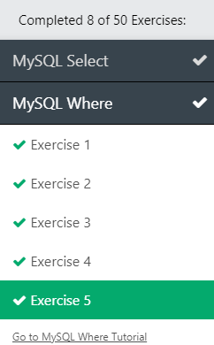
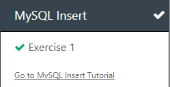
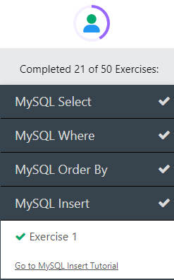
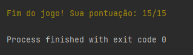
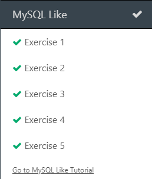
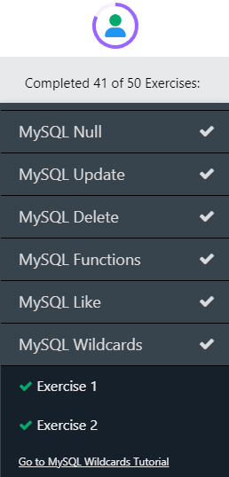
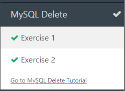
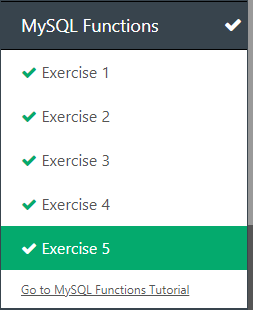
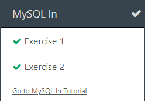
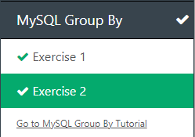
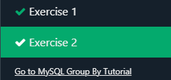
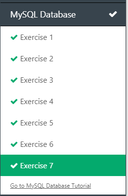

### Sentimento do dia:

Acelarado

----

## Data: [DD-MM-AAA]

### O que aprendi hoje:
A revisar os conceitos de SQL da aula passada e o jogo da investigação futurista

### O que achei mais difícil:
A fase "Selecione apenas as estações localizadas no setor Alfa"
### O que mais gostei:
De jogar o jogo que nosso professor produziu

### Exercicio do dia
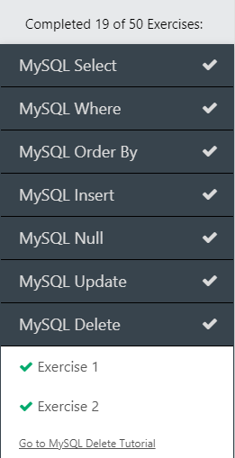
### Sentimento do dia:
