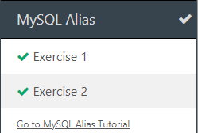
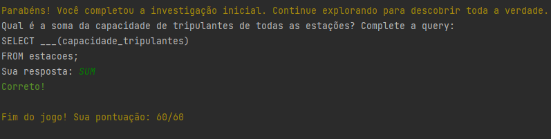

c

---
## Data: [11 e 18-4-202]

### O que aprendi hoje:
aprendi oque é o github os comandos dele e para que ele serve

### O que achei mais difícil:
achei difícil entender o github

### O que mais gostei:
os comandos do github 

### Sentimento do dia:

# 

## Data: [02-05-2020]

### O que aprendi hoje:
aprendi oque é o github os comandos dele e para que ele serve

### O que achei mais difícil:
achei difícil entender o github

### O que mais gostei:
os comandos do github 

### Sentimento do dia:

# Diário de Bordo - [Hellow 2024/Trilha DEV Backend]

## Data: [02-05-2024]

### O que aprendi hoje:
aprendi a programar no java
### O que achei mais difícil:
entender

### O que mais gostei:
dos exercicios

### Sentimento do dia:

# Diário de Bordo - [Hellow 2024/Trilha DEV Backend]

## Data: [09-05-2024]

### O que aprendi hoje:
aprendi if e scanner para ter mais de uma resposta

### O que achei mais difícil:
executar

### O que mais gostei:
do jogo que o professor criou

### Sentimento do dia:

 
# # Diário de Bordo - [Hellow 2024/Trilha DEV Backend]

## Data: [16-05-2024]

### O que aprendi hoje:
aprendi o que é "for" e "while"

### O que achei mais difícil:
as fases do jogo

### O que mais gostei:
do jogo que o professor criou

### Sentimento do dia:

# Data: [16-05-2024]

### O que aprendi hoje:
existem sites no google para treinar java

### O que achei mais difícil:
entender

### O que mais gostei:
jogar

### Sentimento do dia:
()

# Data: [16-05-2024]

### O que aprendi hoje:
a usar comandos no jogo do minecraft

### O que achei mais difícil:
nãoa achei difícil

### O que mais gostei:
do jogo do Minecraft

### Sentimento do dia:
  

### Certificado

### Fase que eu gostei

# Data: [20-06-2024]

### O que aprendi hoje:
Aprendi QSL e banco de dados

### O que achei mais difícil:
Os comandos do banco de dados

### O que mais gostei:
Dos exercícios

### Exercícios do dia

### Sentimento do dia:

## Data: [04-07-2024]

### O que aprendi hoje:
avg, min, max, sum, limit, order by

### O que achei mais difícil:
interprertar as perguntas

### O que mais gostei:
aprender

### Exercícios do dia

### Sentimento do dia:

## Data: [01-08-2024]

### O que aprendi hoje:
Fazer uma foto falar

### O que achei mais difícil:
Nada

### O que mais gostei:
usar o leonardo IA
### Sentimento do dia:

### Atividades do dia
### Video gerado por IA:
<video src="da679c87-9fac-4391-a95b-a85e4ac77e72%20(1)%20-%20Copia.mp4" controls title="Title"></video>

### Foto gerada por IA:

### audio gerado por IA:<audio 
<audio src="ttsmaker-file-2024-8-1-16-19-23-2.mp3" controls title="Title"></audio>

## Data: [11-07-2024]

### O que aprendi hoje:
Comandos SQL
### O que achei mais difícil:
A prova
### O que mais gostei:
Da minha nota
### Sentimento do dia:

### Prova do dia

