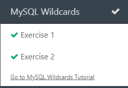

# Diário de Bordo - [Hellow 2024/Trilha DEV Backend]

## Data: [DD-MM-AAA]

### O que aprendi hoje:
Descreva em detalhes o que você aprendeu durante a aula de hoje. Tente ser o mais específico possível, mencionando conceitos, técnicas ou insights que foram importantes para você.

### O que achei mais difícil:
Explique quais partes da aula de hoje foram mais desafiadoras para você e por quê. Isso pode incluir tópicos que você achou complexos, perguntas que permaneceram sem resposta ou habilidades que você sentiu que precisava desenvolver mais.

### O que mais gostei:
Compartilhe o que você mais gostou na aula de hoje. Isso pode ser um tópico específico que foi discutido, uma atividade prática que foi realizada, ou mesmo uma história ou exemplo que o professor compartilhou.

### Sentimento do dia:

Escolha um GIF que melhor represente seu sentimento sobre a aula de hoje. Você pode usar sites como Giphy para encontrar o GIF perfeito.

---
## Data: [11 e 18-04-2024]

### O que aprendi hoje:
aprendi a clonar repositorios, colocar imagens no meu curriculo e tambem aprendi para que serve o git hub

### O que achei mais difícil:
achei meio desafiador por ter varios codigos.
### O que mais gostei:
dos espaços grandes do senai e dos codigos.

### Sentimento do dia:

## Data: [25-04-2024]

### O que aprendi hoje:
fizemos o diario de bordo, aprendi um pouco de java.

### O que achei mais difícil:
java script e os seus codigos.
### O que mais gostei:
da aula e, de mexer no java
### Sentimento do dia:

## Data: [02-05-2024]

### O que aprendi hoje:
aprendi a declarar uma variavel e aprendi mais sobre java.

### O que achei mais difícil:
java no inicio dos seus codigos.
### O que mais gostei:
de aprender a mexer com os codigos.
### Sentimento do dia:

## Data: [09-05-2024]

### O que aprendi hoje:
aprendi if e scanner para ter mais de uma resposta

### O que achei mais difícil:
entender como como usar if e scanner
### O que mais gostei:
de entender
### Sentimento do dia:

 
## Data: [02-05-2024]

### O que aprendi hoje:
aprendi a declarar uma variavel e aprendi mais sobre java.

### O que achei mais difícil:
java no inicio dos seus codigos.
### O que mais gostei:
de aprender a mexer com os codigos.
### Sentimento do dia:

## Data: [16-05-2024]

### O que aprendi hoje:
aprendi o que e "for" e "while"

### O que achei mais difícil:
entender como jogar
### O que mais gostei:
o jogo que jogamos
### Sentimento do dia:

## Data: [23-05-2024]

### O que aprendi hoje:
if else e if

### O que achei mais difícil:
fazer os exercicios
### O que mais gostei:
começar a fazer os exercicios
### Sentimento do dia:

## Data: [06-06-2024]

### O que aprendi hoje:
estrutura de repetição 

### O que achei mais difícil:
fazer os exercicios
### O que mais gostei:
dos exercicios
### Sentimento do dia:

## Data: [16-06-2024]

### O que aprendi hoje:
estrutura de repetição

### O que achei mais difícil:
nao tive dificuldades
### O que mais gostei:
do jogo que tinha como base o minecraft
### Sentimento do dia:
!

### certificado

 

 ### fase que mais gostei
 

 ## Data: [20-06-2024]

### O que aprendi hoje:
banco de dados 

### O que achei mais difícil:
compreender algumas coisas
### O que mais gostei:
dos banco de dados
### exercicios do dia:

### Sentimento do dia:
!

