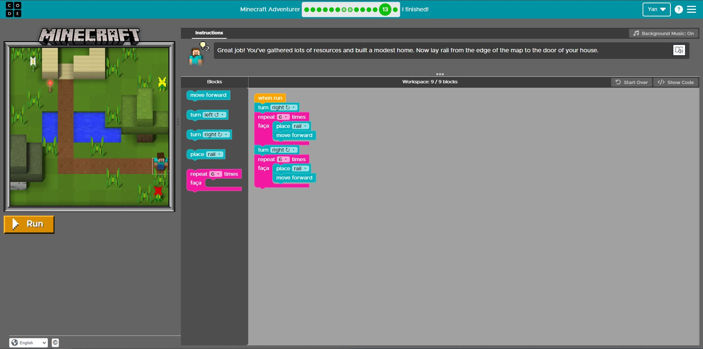

# Diário de Bordo - [Hellow 2024/Trilha DEV Backend]

## Data: [DD-MM-AAA]

### O que aprendi hoje:
Descreva em detalhes o que você aprendeu durante a aula de hoje. Tente ser o mais específico possível, mencionando conceitos, técnicas ou insights que foram importantes para você.

### O que achei mais difícil:
Explique quais partes da aula de hoje foram mais desafiadoras para você e por quê. Isso pode incluir tópicos que você achou complexos, perguntas que permaneceram sem resposta ou habilidades que você sentiu que precisava desenvolver mais.

### O que mais gostei:
Compartilhe o que você mais gostou na aula de hoje. Isso pode ser um tópico específico que foi discutido, uma atividade prática que foi realizada, ou mesmo uma história ou exemplo que o professor compartilhou.

### Sentimento do dia:

Escolha um GIF que melhor represente seu sentimento sobre a aula de hoje. Você pode usar sites como Giphy para encontrar o GIF perfeito.

---
# Diário de Bordo - [Hellow 2024/Trilha DEV Backend]

## Data: [13-06-2024]

### O que aprendi hoje:
como fazer programação com o steve do minecraft

### O que achei mais difícil:
nada eu sou bom

### O que mais gostei:

### Sentimento do dia:

# Diário de Bordo - [Hellow 2024/Trilha DEV Backend]

## Data: [27-06-2024]

### O que aprendi hoje:
a encontrar, ordenar, etc.

depois do intervalo
)
### O que achei mais difícil:
nada eu sou bom

### O que mais gostei:
tudo
### Sentimento do dia:

# Diário de Bordo - [Hellow 2024/Trilha DEV Backend]

## Data: [04-07-2024]

### O que aprendi hoje:
programação

### O que achei mais difícil:
tudo

### O que mais gostei:
tudo

### Sentimento do dia:
INICIO

FINAL

# Diário de Bordo - [Hellow 2024/Trilha DEV Backend]

## Data: [01-08-2024]

### O que aprendi hoje:
a usar inteligencia artificial

### O que achei mais difícil:
o yuri me mandando sopa de macaco

### O que mais gostei:
rir com o professor e meus colegas

### Sentimento do dia:

### Atividades do dia

<video src="3c756a30-942f-4141-8d69-a65425beb374.mp4" controls title="Title"></video>
<audio src="ttsmaker-file-2024-8-1-16-17-47.mp3" controls title="Title"></audio>